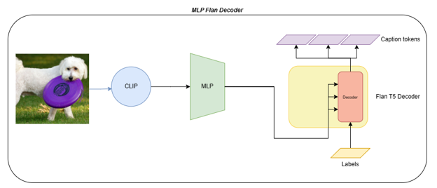

# ClipCap Evolved - Bridging the Gap Between Modalities

*28 Mar 2023* | *Authors: Dawid Kopiczko, Abishek, Dheeraj Varghese, Priyakshi Goswami, Tom Pelletreau-Duris*

Image captioning is a challenging vision-language task that involves automatically generating relevant and valid captions that describes the content of an image. 

Over the years, various approaches have been proposed to tackle this task, with different architectures and training methods being employed. Traditionally, most image captioning pipelines rely on a combination of a visual encoder to encode visual information and a textual decoder that generates captions based on the encoded features. Earlier deep learning based image captioning approaches typically used CNN-encoders and RNN-language models ([Karpathy et al.](https://arxiv.org/abs/1412.2306), [Vinyals et al.](https://www.cv-foundation.org/openaccess/content_cvpr_2015/papers/Vinyals_Show_and_Tell_2015_CVPR_paper.pdf)), however with recent trends [Transformer](https://arxiv.org/abs/1706.03762)-based models have gained popularity. The visual feature extraction stage has also seen significant changes, moving towards the use of multi-modal architectures trained on large-scale data with language supervision, as seen in models like [CLIP (Contrastive Language-Image Pretraining)](https://arxiv.org/abs/2103.00020).

One prevalent approach to image captioning involves utilizing pretrained vision and language models, which are then fine-tuned. Our baseline approach, called [ClipCap](https://arxiv.org/abs/2111.09734), adheres to this paradigm by employing CLIP-ViT as the visual encoder and GPT-2 as the textual decoder. In their approach, the image embeddings are sent as prefixes of captions to the Language Model (LM) which then generates the next token. Alternative approaches like [Flamingo](https://arxiv.org/abs/2204.14198) and [VC-GPT](https://arxiv.org/abs/2201.12723) fuse visual information from the encoder directly into the layers of a pre-trained LM using a cross attention mechanism.

In this blog post, we share our work building upon ClipCap and address key research questions. We review the background and key components, including models and fine-tuning techniques. Our proposed methods are presented, highlighting improvements over the baseline. We also discuss our experiments, results, and future directions.

*The "Background and Key Components" section offers a brief overview of CLIP, language models, and parameter-efficient fine-tuning methods. It aims to familiarize readers with these essential aspects before diving into the main part. If you are already familiar with these concepts, feel free to skip this section and proceed further.*

## Introducing ClipCap

The authours of ClipCap propose a simple yet effective technique to generate captions. As mentioned before, CLIP is utilised to extract the visual embeddings of the image, which is the condensed representation of the content. This is used as a prefix to the GPT2 input, which then generates the caption based on both the image and the prefix. A simple mapping network is employed to transform the embedding into a compatible format for GPT2. They follow two approaches,

1. Using an MLP mapper, along with finetuning GPT2
2. Using a transformer mapper

Their second approach demonstrate that training the mapping network alone can yield competent captioning results while keeping CLIP and the LM frozen.

At the time of their publication, this method achieved comparable performance to State-Of-The-Art approaches on challenging datasets such as Conceptual Captions and nocaps, while being simpler, faster, and lighter. However, it is worth noting a couple of potential weaknesses. Firstly, they failed to explore the utility of unpooled visual representations, which may affect its ability to capture fine-grained visual details; and the limited evaluation with different language models, which may leave room for further exploration and analysis. This is exactly what inspired us to explore and pursue this research direction.

## Background and Key Components

In this section, we introduce the essential models and methods that serve as building blocks for our image captioning architectures.

### CLIP-ViT

Contrastive Language Pre-Training (CLIP) is an efficient method of learning  from natural language supervision developed by OpenAI. Designed to understand and generate meaningful associations between text and images, CLIP models are effective multimodal visual language models that can be used for a range of tasks, including zero-shot image classification and image-text similarity. 

#### Architecture
CLIP architecture consists of two main components, a text encoder, and an image encoder. These two encoders are jointly trained using a contrastive learning approach to predict the correct pairings of a batch of training (image, text) examples. The CLIP model encodes textual and visual information into a multimodal embedding space, with an aim to increase the cosine similarity score of images and text representations. 

The original clip implementation uses a transformer as its text encoder. For the image encoder, the authors propose two separate architectures, one with a [ResNet](https://arxiv.org/abs/1512.03385), and the other with a [Vision Transformer (ViT)](https://arxiv.org/abs/2010.11929).

###### Vision Transformer
The Vision Transformer (ViT) model architecture was introduced in the paper titled “An Image is Worth 16*16 Words: Transformers for Image Recognition at Scale”, where the authors utilise the transformer architecture for image processing tasks. The proposed architecture involves processing images by splitting an image into fixed size patches, linearly embedding them along with positional embeddings, and then inputting the resultant sequence of vectors to a standard transformer architecture.

The results of the experiments demonstrate that the ViT encoder architecture performs better than the ResNet based encoder architecture on a wide range of datasets. Additionally, the baseline ClipCap implementation uses the CLIP-ViT as its image encoder.

In case of CLIP-ViT, the output tokens from the Vision Transformer are pooled into a single vector and passed through a projecting linear layer.

### GPT-2

OpenAI's [GPT-2 (Generative Pretrained Transformer 2)](https://openai.com/research/gpt-2-1-5b-release) is a large transformer-based language model pretrained on an extensive corpus of English text in a self-supervised manner, enabling it to learn a comprehensive understanding of language and generate coherent and contextually relevant text.

GPT-2 is pretrained in a self-supervised way on raw data without any human labelling with an automatic process to generate inputs and labels from those texts. More specifically, the model is trained to predict the next token in sentences. The inputs to the model are sequences of continuous text, with a specific length, and the targets are the same sequences, but shifted one token to the right. The model internally employs a masked self-attention mechanism, ensuring that predictions for a given token only use the inputs up to that token and not the future tokens. This autoregressive training setup enables the model to capture the sequential dependencies and learn the underlying patterns in the language.

There are several sizes of GPT-2 available:

| GPT-2 variant| Small |   Medium | Large | Extra Large |
|--------------|-------|----------|-------|-------------|
|Parameters    | 117M  |  345M    | 762M  |  1,542M     |

### FLAN-T5

[Flan-T5](https://arxiv.org/abs/2210.11416) is an enhanced version of the original [T5 architecture](https://arxiv.org/abs/1910.10683) intoduced by Google in 2019. The T5 (Text-to-Text Transfer Transformer) architecture is built on standard encoder-decoder transformer. The encoder processes the input text, generating a representation that captures contextual information and semantic understanding. This representation serves as a conditioning signal for the decoder. The decoder, in turn, attends to this representation, which uses it to generate the output text gradually.

T5 follows a "text-to-text" approach, where all NLP tasks are framed as text-to-text problems. This allows T5 to be fine-tuned on various downstream tasks with minimal modifications, making it highly versatile. FLAN-T5 (Fine-tuned Language Net) improves upon T5 by fine-tuning it on a diverse set of tasks that cover various languages and domains. This enables FLAN-T5 to achieve state-of-the-art performance on several benchmarks.

Flan-T5 model offers 5 different variants:

|FLAN-T5 variant| Small |   Base | Large | XL | XXL   |
|---------------|-------|--------|-------|----|-------|
|Parameters     | 80M   | 250M   |780M   | 3B | 11B   |

### Parameter Efficient Fine Tuning

A common practice in the field of NLP is the usage of pretrained models and adapting it to other downstream tasks by finetuning it for a particular task or dataset. However, as LLMs are becoming increasingly large with billions of parameters, it becomes prohibitively hard to train such models. Parameter-Efficient Fine-Tuning(PEFT) techniques help overcome this by freezing most of the pretrained model’s parameters and modifying a small subset of the parameters. [“Delta Tuning: A Comprehensive Study of Parameter Efficient Methods for Pre-trained Language Model”](https://arxiv.org/abs/2203.06904) broadly classifies these techniques into 3 categories:

 - Addition-based methods, which add new parameters to the original model and fine-tune them while keeping the original parameters fixed. Examples include [Adapters-based tuning](http://proceedings.mlr.press/v97/houlsby19a.html) and [prompt based tuning](https://arxiv.org/abs/2108.02035).
 - Specification-based methods only fine-tune a subset of the original parameters that are specified by [heuristics](https://arxiv.org/abs/1911.03090).
 - Reparameterization-based methods transform the adaptive parameters during optimization into parameter efficient forms, typically motivated by the hypothesis that LM adaptations towards most downstream tasks are inherently low-rank, and could thus be equivalently completed in a parameter-efficient way. A particularly interesting implementation is that of [Low-Rank Adaptation (LoRA)](https://arxiv.org/abs/2106.09685) of large language models. 

#### Low Rank Adaptation

Low Rank Adaptation (LoRA) is a technique introduced by Hu et al. in their paper as efficient fine tuning technique that can greatly reduce the number of trainable parameters for downstream tasks, by freezing the pre-trained model weights and injecting trainable rank decomposition matrices into each layer of the Transformer architecture. In particular, LoRA use tensor-train decomposition of the weight matrix and decompose it into two "update matrices".

For any model layer that can be expressed as a matrix multiplication of the form $h=W_0x$, it can be reparametrised as follows 

$h = W_0+\frac{\alpha}{r}BAx$

where, $A\in\mathbb{R}^{r \times k}$ and $B\in\mathbb{R}^{d \times r}$ and *r* is the low dimensional rank of the decomposition. 

##### Advantages of LoRA

- Since the original pretrained language model is frozen, training using LoRA is more efficient, as we do not need to calculate the gradients or maintain optimizer states for most parameters, and calculate only for the injected much smaller lower rank matrices. The authors note that for a large Transformer trained with Adam, we reduce that VRAM usage by up to 2/3 if r <<  $d_{model}$ as we do not need to store the optimizer states for the frozen parameters
- Adapter layers often introduce inference latency, by extending model depth or reducing the model’s usable sequence length. LoRA overcomes this issue by proposing that when deploying models in production we can explicitly compute $W = W_0+BA$ and store the weight matrix and perform inference as usual. When the pretrained LM needs to be adapted to a new downstream task, the original $W_0$ can be recovered by subtracting BA and a new B’A’ can be summed for the new task
- LoRA is orthogonal to many prior methods and can be combined with many of them, such as prefix-tuning.

## Approaches & Architectures

In this study, we explore different approaches to improve the generation of accurate and descriptive captions for images, while considering the impact on trainable parameters.

### Baselines

We begin by replicating the ClipCap architectures to establish baseline performance. Our focus lies on replicating two variants of the architecture, while employing the CLIP-VIT/32 model as the visual encoder. These serve as reference points to evaluate and compare the effectiveness of our approaches. 
 
##### ClipCap, The MLP Approach
&nbsp;&nbsp;&nbsp;&nbsp;&nbsp;&nbsp; 

##### ClipCap, The Transformer Approach
&nbsp;&nbsp;&nbsp;&nbsp;&nbsp;&nbsp;

### Language Model Architecture Matters

ClipCap utilized GPT2, a decoder-only transformer, to generate tokens autoregressively. While this approach proved effective, we sought to optimize it further by introducing an additional conditioning signal to the cross-attention layers. This insight was inspired by techniques used in the Flamingo paper. The addition of a conditioning signal to the decoder blocks is hypothesized to enhance caption generation performance. This signal delivers an additional layer of context at each decoding step, thus facilitating the decoder to construct more accurate and coherent output.

Based on this observation, we explore the use of encoder-decoder models as a promising direction. This resulted in our incorporation of the Flan-T5 model into the ClipCap architecture. The decision to integrate Flan-T5 into ClipCap was motivated by its versatility in handling a multitude of tasks, each one encoded by the encoder. This presents a unique opportunity for improving the caption prediction process. By feeding a prefixed sentence to the encoder block, we are priming the decoder, theoretically enabling it to predict captions more effectively. This is predicated on the hypothesis that the encoder's capacity to embed different tasks will substantially enhance the decoder's proficiency in generating precise and pertinent captions.

#### Using FLAN-T5 as the LM

#### Using FLAN-T5 Decoder Only

Another approach in our exploration involves utilising only the decoder component of the FLAN-T5 model. In this variant, we decided to bypass the encoder and feed the inputs from the previous components directly to the pre-trained cross attention layers of the decoder. We tested this variant with the two mappers: MLP and Transformer.

##### FLAN-T5 Decoder, The MLP Approach

##### FLAN-T5 Decoder, The Transformer Approach

### Beyond Pooled Features: Exploiting Visual Representations

In order to enhance the utilization of visual representations in our models, we propose a departure from using pooled and projected features. Instead, we advocate for leveraging the unpooled representations, which capture more comprehensive visual information. By preserving the richness of visual details that can be lost through pooling and projection, we aim to provide the language model with a more robust and nuanced image representation.

To effectively incorporate these unpooled visual tokens into our models, we take steps to align the representation spaces of the visual and language models. This involves passing the visual tokens through a Multilayer Perceptron with shared weights for all tokens. Subsequently, these refined tokens are fed into the language model. For GPT2 and Flan-T5, they act as the prefix, while for the Flan-T5 decoder, they serve as the entire conditioning signal. We anticipate that this tweak will result in improved performance.

The shared MLP projects the visual tokens that are not pooled. This means we utilise all the tokens that CLIP-ViT outputs. These tokens, after projection, are directly mapped to the LM.

### Parameter-Efficient Fine-tuning with LoRA

Translating between the representations of image encoder of CLIP and the language model was a challenge faced by the authors of ClipCap. This is owed to the independent training of both models, leading to separate latent spaces. To address this, the authors emphasize the need for fine-tuning the Language Model (LM) along with the mapping network training. However, it is to be noted that fine-tuning the LM substantially escalates the number of trainable parameters (~156M for GPT2). As an alternative approach, the authors freeze the LM and replace the MLP mapping network with a transformer, effectively reducing the trainable parameters to ~43M.

To further optimize the model, we experiment with LoRA, a parameter efficient fine tuning technique. We apply LoRA to the baseline architecture (MLP mapper + GPT2) and our best-performing models. We also test it across all layers as well as a subset of layers of the LM.

### Configuration of Mappers

For all architectures utilising the MLP mapper we use the following hyperparameters:

| Parameter | Value                     |
|-------------------------|---------------------------|
| Hidden Layers           |     1                     |
| Hidden Layer Size    | 3840         |
| Activation              | Tanh                      |
| LM Prefix Length   | 10                |

The configuration of the transformer mapper:

| Parameter               | Value                     |
|-------------------------|---------------------------|
| Num Layers              | 8                         |
| Attention Heads         | 8                         |
| Embedding Dimension     | 768                       |
| Trainable Prefix Length   | 10                |
| LM Prefix Length   | 10                |

<!-- ### Naming Conventions and Experimental Runs

We provide a table with naming conventions for different experimental runs to ensure clear understanding and easy reference.

(table) -->

## Methodology

We used CLIP-ViT/32, GPT-2, and FLANT5 models sourced from [Hugging Face's Transformers library](https://huggingface.co/docs/transformers/index). In order to maintain consistency with the original ClipCap approach, we have preserved all hyperparameters:

- Batch size: 40
- Learning rate: 2e-5
- Optimizer: AdamW
- Warm-up steps: 5000

In contrast to the original ClipCap implementation, which first extracted visual features with CLIP before proceeding to train different architectures, we adopted a simpler approach. Rather than dividing the procedure into two separate steps, we integrated CLIP into the training loop, allowing it to extract features at each training step. This method offers a better overview of the actual training time that such an implementation would take.

Our methodology involved running each model through 10 training epochs. To capture the model's optimal performance, we stored checkpoints throughout and identified the best one based on the lowest validation loss. This optimal checkpoint served as the basis for subsequent model evaluations, ensuring an accurate representation of the model's capabilities at its peak performance.

### Datasets

Choosing good datasets is a critical step for training and evaluating. The notion of "good dataset" in the context of visual-language tasks relies mainly on the diversity of context, topics and entities that the image and captions are covering. Following the original paper, we used the two datasets, COCO and NOCAPS, both considered state-of-the-art datasets for image captioning modelling (.

Similar to ClipCap work, we use COCO dataset to train models, and both, COCO and nocaps, to evaluate them. The authors of the ClipCap paper also train and evaluate their models on the large [Conceptual Caption (CoCa)](https://aclanthology.org/P18-1238/), separately from the model trained on COCO. However, due to the substantial computational resources and time required to process CoCa's extensive collection of over 3 million images, we opted not to use this dataset.

#### COCO

[COCO (Common Objects in Context)](https://arxiv.org/abs/1405.0312) is a large-scale dataset for image recognition, segmentation, and captioning. It contains over 200K images and 1.2M captions. We used the [Karpathy split](https://cs.stanford.edu/people/karpathy/deepimagesent/) for our experiments, which is the same as used in the ClipCap work. The Karpathy split divides the dataset into 113K training images, 5K validation images, and 5K test images.

We train our models on the training set, and perform evaluation on the test one.

#### NOCAPS

[NOCAPS (Novel Object CAPtioning dataset)](https://arxiv.org/abs/1812.08658) contains over 166K images and 1.5M captions. It is designed to measure the robustness and generalization of image captioning models to novel objects and concepts. It consists of three subsets: in-domain (containing only COCO classes), near-domain (contains both COCO and novel classes), and out-of-domain (contains only novel classes).

Similar to the approach taken in the original ClipCap study, we use a validation set containing 9K images for model evaluation. We paid particular attention to analyzing results from the out-of-domain subset, given its complexity and the challenging tasks it represents. Models that are exclusively trained on COCO data are prone to making significant errors on this subset, thus providing a realistic representation of the performance of COCO-trained models in real-world situations. 

### Evaluation

We evaluated our models on both quantitative and qualitative metrics.

#### Generation

For the caption generation, the exact procedure from the original ClipCap paper is not clearly defined. To ensure consistency across our evaluations, we decided to implement a uniform approach by adopting a greedy search algorithm for all models. This strategy picks the most likely word at each step in the sequence, with the maximum length of the caption set to 67 tokens.

#### Quantitative Evaluation

##### Evaluation metrics

Image captioning is a notoriously difficult task to evaluate due to its inherent ambiguity (Cui et al., 2018). Human evaluation scores are reliable but expensive to obtain and not reproducible. Thus, current image captioning models are usually evaluated with automatic evaluation metrics. Similar to the Clipcap paper, we validate our model over the COCO and nocaps datasets using the [CIDEr](https://arxiv.org/abs/1411.5726) and [SPICE](https://arxiv.org/abs/1607.08822) metrics. We decided to discard [BLEU](https://aclanthology.org/P02-1040/), [ROUGE-L](https://aclanthology.org/W04-1013.pdf) and [METEOR](https://aclanthology.org/W14-3348/) now considered out-dated [(Cui et al., 2018)](http://arxiv.org/abs/1806.06422). 

Most of the metrics in common use for caption evaluation are based on n-gram matching and measure the word overlap and semantic similarity between the generated captions and the reference captions from the datasets. The most known ones are BLEU, ROUGE and METEOR. However, they have been outdated in their evaluation range capabilities, and more complex and robustness-measuring metrics have been developed, which are now considered [state-of-the-art metrics](http://arxiv.org/abs/1607.08822). First, previous metrics were primarily sensitive to n-gram overlap which made them sensitive to the size of the dataset. On the other hand, the novel metrics are size-independent and have been shown to have the [strongest correlation with human judgments](https://doi.org/10.1109/ICCV.2017.100). In particular, To overcome the limitations of existing n-gram based automatic evaluation metrics, SPICE hypothesises that semantic propositional content is an important component of human caption evaluation and estimates caption quality by transforming both candidate and reference captions into a graph-based semantic representation called a scene graph, which make it more content-equivariant. The scene graph explicitly encodes the objects, attributes and relationships found in image captions, abstracting away most of the lexical and syntactic idiosyncrasies of natural language in the process.

[CIDEr](http://arxiv.org/abs/1411.5726) applies term frequency-inverse document frequency (tfidf) weights to n-grams in the candidate and reference sentences, which are then compared by summing their cosine similarity across n-grams. It is worth noting that CIDEr score is the only one that ranges from 0 to infinity. The score is calculated using the average cosine similarity between the candidate sentence and the reference sentences. The score can be greater than 1 if the candidate sentence is more similar to the reference sentences than the reference sentences are to each other. Being an F-score,  [SPICE](http://arxiv.org/abs/1607.08822) is simple to understand, and easily interpretable as it is naturally bounded between 0 and 1. Unlike CIDEr, SPICE does not use cross-dataset statistics, such as corpus word frequencies, and is therefore equally applicable to both small and large datasets. 
In summary, while CIDEr focuses on consensus and overall relevance, SPICE centers on semantic propositions. The CIDEr metric assesses how well the machine-generated caption aligns with the consensus annotations of human captions for the same image. If the caption reflects the overall content and significance of the image, and is similar to the consensus captions, it receives a high CIDEr score. The SPICE metric, on the other hand, evaluates the precision and recall of semantic propositions in the machine-generated caption. It analyses how accurately the caption represents the semantic relationships within the image. If the caption correctly identifies the presence of people, a picnic, and a park, and expresses their relationships accurately, it will receive a high SPICE score.

We evaluate on COCO locally following the [OSCAR methodology](http://arxiv.org/abs/2004.06165), same as done in ClipCap, while for the NOCAPS dataset, we submit generated captions to the official nocaps challange on the [EvalAI](https://eval.ai/web/challenges/challenge-page/355) evaluation server.

Additionally, we report _total number of parameters_ of the model, _number of trainable parameters_, and _estimated training time_. Less trainable parameters can be linked to faster convergence time, while total number of parameters would influence the inference speed.

#### Qualitative Evaluation

We conduct the qualitative evaluation by generating the captions of the five first images of the COCO dataset and 3 images of the NOCAPS, one in domain, one near domain and one out of domain. We conduct human evaluation using [THumB](https://arxiv.org/pdf/2111.08940.pdf), a rubric-based protocol that assesses the quality of captions along two main dimensions: precision (how accurate and relevant the caption is) and recall (how much salient information the caption covers) and is designed to promote the human evaluation transparency for qualitative evaluation. First we define the _precision_ of the caption, counting the number of false positives (hallucinations), scored from 0 to 5. Then we define _recall_ which measure how much of the salient information from the image is covered by the caption, also scored from 0 to 5. For instance, an otter is a small animal, and thus small animal is precise. However, it is much less informative (and less natural) than saying an otter. Finally, we add a penalty based on the [_fluency_](https://arxiv.org/pdf/2111.08940.pdf) of the sentence from -1 to 0 if there is weird repetitions, misspellings or grammatical errors. There is also the Conciseness and the Inclusive Language to take into account but we did not target these problems.

## Results

#### Quantitative evaluation

In the following tables we report CIDEr and SPICE scores on the COCO dataset. Scores for the nocaps dataset are reported for the selected set of models, and can be found at the end of this section.

Certain results in the study follow a specific naming convention with the following order: *LM, size, visual representation (Pooled, Unpooled), mapper (MLP, Transformer) and finetuning (FT)*.

### Baseline Runs

| Language Model         | LM Size | LM Finetuning | Mapper      | CIDEr ↑        | SPICE ↑        | Runtime(Hours) ↓ | Total Parameters(M) ↓ | Trainable Parameters(M) ↓ |
| ---------------------- | ------- | ------------- | ----------- | -------------- | -------------- | ---------------- | --------------------- | ------------------------- |
| GPT2                   | base    | Finetuned     | MLP         | **101.58**    | **14.16**    | 12.91            | **244**                   | 156                       |
| GPT2                   | base    | Frozen        | Transformer | 91.57    | 13.45     | **10.77**            | 254                   | **42**                        |

Using CIDEr and SPICE scores on COCO dataset as our primary evaluation metrics, we observed results that didn't precisely match those reported in the original ClipCap paper. It's important to note here that the disparity might be due to the different methods of caption generation employed, given that the exact procedure was not explicitly stated in the original paper, as previously mentioned.

Nonetheless, a significant validation of our approach was that our training and validation loss matched those from the original ClipCap repository when using default parameters. This consistency suggests that our training procedure was robust, despite the discrepancies in caption generation outcomes.

As for the training time, there was a noticeable increase in our case compared to the original paper. This increase can be attributed to our decision to include the CLIP model in the forward pass. Unlike the original work, where visual feature extraction was a separate step, we integrated this process within the training loop, as mentioned in an earlier section.

### Comparison of Language Models

| Language Model         | LM Size | LM Finetuning | Mapper      | CIDEr ↑       | SPICE ↑       | Runtime(Hours) ↓ | Total Parameters(M) ↓ | Trainable Parameters(M) ↓ |
| ---------------------- | ------- | ------------- | ----------- | ------------- | ------------- | ---------------- | --------------------- | ------------------------- |
| GPT2                   | base    | Finetuned     | MLP         | 101.58        | 14.16         | 12.91            | 244                   | 156                       |
| FLAN-T5                | base    | Finetuned     | MLP         | 105.52        | 19.49         | 13.16            | 367                   | 141                       |
| FLAN-T5 (Decoder Only) | base    | Finetuned     | MLP         | **106.8**         | **19.96**         | 12.7             | 282                   | 194                       |
| FLAN-T5                | small   | Finetuned     | MLP         | 95.13         | 18.08         | 6.6              | 186                   | 57                        |
| FLAN-T5 (Decoder Only) | small   | Finetuned     | MLP         | 104.44        | 19.85         | 6.8              | 168                   | 80                        |
| GPT2                   | base    | Frozen        | Transformer | 91.57         | 13.45         | 10.77            | 254                   | 42                        |
| FLAN-T5 (Decoder Only) | base    | Frozen        | Transformer | 93.62         | 18.87         | 10.4             | 292                   | 42                        |
| FLAN-T5                | base    | Frozen        | Transformer | 91.56 | 17.97 | 11.7   | 377        | 42            |
| FLAN-T5                | small   | Frozen        | Transformer | 90.33         | 17.41         | 7.1              | 184                   | **19**                        |
| FLAN-T5 (Decoder Only) | small   | Frozen        | Transformer | 93.19         | 18.2          | **6.44**             | **165**                   | **19**                        |

When comparing the results for different sizes of the FLAN-T5 decoder with the Transformer Mapper, we observe minimal changes. Furthermore, the SPICE scores consistently favor the FLAN-T5-based models, particularly the Decoder only variants. 

In terms of the CIDEr score, all FLAN-T5 variations outperform the baseline model, except for the small sized model. Notably, FLAN-T5 Decoder only models achieve higher scores than the full FLAN-T5 counterpart. Among the Decoder only models, the base size demonstrates the best performance on both metrics. Additionally, even the small version of the finetuned FLAN-T5 surpasses the performance of the best baseline model, while reducing the trainable parameters by almost half.

<!-- We can notice that results for different sizes 
- results for different sizes of flant5 decoder with transformer barely change (maybe confirm with captions and sum it up in discussion)
- spice scores are always higher for flan-t5 based models, especially for decoder only versions
- compared to the baseline, cider score is improved in all cases except small version of flan-t5
- we can see that flan-t5 decoder only version has higher scores than full version
- flant5 decoder only (base) achieves the best results on both metrics; small version also achieves better results than best baseline model, having half less trainable parameters -->

### Analyzing the Utility of Unpooled Visual Representations

| Language Model    | LM Size | LM Finetuning | Image Embeddings | CIDEr ↑       | SPICE ↑       | Runtime(Hours) ↓ | Total Parameters(M) ↓ | Trainable Parameters(M) ↓ |
| ----------------- | ------- | ------------- | --------------- | -----------  | ----------- | ---------------- | --------------------- | ------------------------- |
| GPT2              | base    | Frozen        | Pooled          | 92.06        | 13.31       | 9.9              | 244                   | 31                        |
| GPT2              | base    | Finetuned     | Pooled          | 101.59       | 14.16       | 12.9             | 244                   | 156                       |
| FLAN-T5           | small   | Finetuned     | Pooled          | 95.14        | 18.08       | 6.6              | 186                   | 57                        |
| FLAN-T5           | base    | Finetuned     | Pooled          | 105.52       | 19.49       | 13.2             | 367                   | 141                       |
| FLAN-T5 (Decoder)| small  | Finetuned | Pooled         | 104.44       | 19.85       |     6.8         | 168                   | 80                       |
| FLAN-T5 (Decoder)| base   | Finetuned | Pooled         | 106.80      | 19.96      |       12.7      | 282                  | 194                      |
| GPT2              | base    | Frozen        | Unpooled        | 84.52        | 12.69       | 15.8             | 218                   | 6                         |
| GPT2              | base    | Finetuned     | Unpooled        | 105.88       | 14.69       | 19.8             | 218                   | 130                       |
| FLAN-T5           | small   | Finetuned     | Unpooled        | 93.81        | 18.08       | 8.2              | 170                   | 40                        |
| FLAN-T5           | base    | Finetuned     | Unpooled        | 107.65       | 19.94       | 18.9             | 341                   | 116                       |
| FLAN-T5 (Decoder) | small   | Frozen        | Unpooled        | 91.23        | 18.03       | **6**                | **151**                   | **5**                         |
| FLAN-T5 (Decoder) | small   | Finetuned     | Unpooled        | 103.59       | 19.64       | 7.6              | **151**                   | 63                        |
| FLAN-T5 (Decoder) | base    | Frozen        | Unpooled        | 95.78        | 18.77       | 10.7             | 256                   | 6                         |
| FLAN-T5 (Decoder) | base    | Finetuned     | Unpooled        | **108.81**       | **20.24**       | 14.2             | 256                   | 169                       |
| FLAN-T5 (Decoder) | large   | Frozen        | Unpooled        | 99.31        | 19.21       | 22.8             | 570                   | 7                         |

We observe a trend where the use of unpooled representations enhances the performance of models with finetuned LMs, while it has a negative impact on frozen LM architectures.

Additionally, we notice that employing larger LMs can improve the performance of frozen FLAN-T5 Decoder models while maintaining a similar number of trainable parameters. **Notably, with only *7 million* trainable parameters compared to *156 million*, we achieve comparable CIDEr scores and better SPICE scores than the finetuned GPT-2 based baseline.**

#### Ablation Study on Hidden Layer Size

Here we perform an ablation study investigating impact of the hidden layer size of the MLP on the performance.
| Language Model    | MLP Hidden Layer Size | CIDEr ↑ | SPICE ↑ | Runtime(Hours) ↓ | Total Parameters(M) ↓ | Trainable Parameters(M) ↓ |
| ----------------- | --------------------- | ------- | ------- | ---------------- | --------------------- | ------------------------- |
| FLAN-T5 (Decoder) | 32                    | 74.38   | 15.17   | **5.4**              | **146**                   | **0.042**                     |
| FLAN-T5 (Decoder) | 128                   | 86.33   | 17.14   | **5.4**              | **146**                   | 0.164                     |
| FLAN-T5 (Decoder) | 256                   | 86.49   | 17.24   | **5.5**              | **146**                   | 0.328                     |
| FLAN-T5 (Decoder) | 512                   | 90.82   | 17.89   | **5.4**              | 147                   | 0.656                     |
| FLAN-T5 (Decoder) | 2048                  | 91.22   | **18.08**   | 5.6              | 149                   | 2.624                     |
| FLAN-T5 (Decoder) | 3840                  | **91.23**   | 18.03   | 6                | 151                   | 4.92                      |

We observe that performance exhibits a sharp increase for hidden layer sizes below 512 indicating their impact on the model's performance. However, once this threshold is surpassed, further increases in hidden layer size result in similar performance levels despite the addition of a substantial number of trainable parameters. From these findings, we can infer that a hidden layer size of 512 would be optimal for this specific use case.

### Application of LoRA

We apply LoRA to the baseline architecture (MLP mapper + GPT2) and our best-performing model, FLAN-T5 LM with a decoder only architecture and a MLP mapper processing unpooled CLIP embeddings. We test this for 3 FLAN-T5 sizes - base, small, and large. Additionally, we attempt to analyse how the application of LoRA to different layers of the language model could affect the results, for which we select 2 cases - applying LoRA to all Linear layers of the LM, and applying it a smaller subset of layers. In case of GPT2, we apply it to "c_attn" and "c_proj", and in case of FLAN-T5, to the "q" and "v" matrices. Motivated by the results from  [Hu et al. (2021)](https://arxiv.org/abs/2106.09685), we decided to apply LoRA to this specific subset of layers in the LM. 

For the LoRA experiments, we use the following hyperparameters

|Hyperparameter|Value|
|--------------|-----|
|Rank          |4    |
|Alpha         |32   |
|Dropout       |0.01 |

 Language Model    | Language Model Size | LM Finetuning           | LM Total Parameters(M)  ↓ | LM Trainable Parameters(M)  ↓ | % Reduction Trainable Parameters ↑| CIDEr   ↑   | SPICE    ↑   | Runtime(Hours)  ↓ | Total Parameters(M)  ↓ | Trainable Parameters(M)  ↓ |
| ----------------- | ------------------- | ----------------------- | ---------------------- | -------------------------- | -------------------------------- | ----------- | ----------- | -------------- | ------------------- | ----------------------- |
| GPT2              | base                | Full LM                 | 125                    | 125                        | 0                                | 101.59 | 14.16 | 12.9           | 243.76             | 155.91                 |
| GPT2              | base                | LORA (All Layers)       | 125                    | 0.794                      | 99.36                            | 96.06 | 13.58 | 11.5           | 244.552             | 32.263                  |
| GPT2              | base                | LORA (Subset of Layers) | 125                    | 0.406                      | 99.68                            | 95.98 | 13.67  | 11             | 244.163             | 31.874                  |
| FLAN-T5 (Decoder) | base                | Full LM                 | 163                    | 163                        | 0                                | **108.81** | **20.23** | 14.2           | 256.376             | 168.526                 |
| FLAN-T5 (Decoder) | base                | LORA (All Layers)       | 163                    | 1.127                      | 99.31                            | 102.29 | 19.43 | 12.2           | 257.503             | 7.03                    |
| FLAN-T5 (Decoder) | base                | LORA (Subset of Layers) | 163                    | 0.295                      | 99.82                            | 101.12 | 19.199  | 10.3           | 256.671             | 6.198                   |
| FLAN-T5 (Decoder) | small               | Full LM                 | **58.5**                   | 58.5                       | 0                                | 103.60 | 19.64  | 7.6            | **150.847**             | 62.997                  |
| FLAN-T5 (Decoder) | small               | LORA (All Layers)       | **58.5**                   | **0.507**                      | 99.13                            | 98.69 | 18.94 | 7.4            | 151.354             | 5.427                   |
| FLAN-T5 (Decoder) | small               | LORA (Subset of Layers) | **58.5**                   | 0.115                      | 99.8                             | 95.09 | 18.73  | **6.1**           | 150.961             | **5.034**                   |
| FLAN-T5 (Decoder) | large               | LORA (All Layers)       | 475                    | 2.811                      | 99.41                            | 103.46 | 19.64 | 28.4           | 572.365             | 9.698                   |
| FLAN-T5 (Decoder) | large               | LORA (Subset of Layers) | 475                    | 0.786                      | **99.83**                            | 102.40 | 19.76  | 23.7           | 570.34              | 7.673                   |

|                           | Full LM | | | LORA (All Layers) | | | LORA (Subset of Layers) |  |  |
| -------------------------- | - | -------| -- | ----------------- | - | - | -------------------------- |- | - |
| | LM Trainable Parameters(M) | CIDEr   | SPICE             | LM Trainable Parameters(M) | CIDEr | SPICE | LM Trainable Parameters(M) | CIDEr | SPICE |
| GPT2_base                  | 125     | 101.59       | 14.16                | 0.794  **(0.64%)**  | 96.06  **(-5.53)**  | 13.58  **(-0.58)**  | 0.406   **(0.32%)**  | 95.98  **(-5.61)**  | 13.67  **(-0.49)**  |
| FLAN-T5 (Decoder)-base     | 163     | 108.81       | 20.24                | 1.127   **(0.69%)**  | 102.29  **(-6.52)**  | 19.43  **(-0.81)**  | 0.295   **(0.18%)**  | 101.12  **(-7.68)**  | 19.2  **(-1.04)**  |
| FLAN-T5 (Decoder)-small    | 58.5    | 103.60       | 19.64                 | 0.507   **(0.87%)**  | 98.69  **(-4.91)**  | 18.94  **(-0.7)**  | 0.115   **(0.2%)** | 95.09  **(-8.5)**  | 18.73  **(-0.9)**  |

We can observe from the obtained results that the models when trained with LoRA, shows a significant  deacrease in trainable parameters (~99.5% reduction on an average), while achieving a comparable but lower scores on both CIDEr and SPICE metrics.

### T5 Weights

We conducted a performance comparison on selected FLAN-T5 architectures with different weights: FLAN-T5 and original T5. To assess this comparison, we have selected the best performing model on the COCO dataset, which is the finetuned FLAN-T5 Decoder only with unpooled representations, and its version with the frozen LM.

It's evident that FLAN-T5 yields better results than T5 version for finetuned and frozen LM, with substantial change when LM is frozen. The analysis of the generated captions can provide explanations on these results.

| Images                      |  |  |  |  |  |
|-----------------------|---------------------------------------------------------------------------------|------------------------------------------------------------------------------------------------------------------|---------------------------------------------------------------------------------|---------------------------------------------------------------------------------|-------------------------------------------------------------------------------------------------------|
| FLAN-T5 (Decoder Only), base, Unpooled, MLP, No FT   | A man on a bike with a backpack.                              | A girl is eating a piece of cake.                                                             | A man standing next to a train on the tracks.                   | A kitchen with a sink, a window and a window.                   | A group of stacked wooden spoons sitting on a table.                                  |
| T5 (Decoder Only), base, Unpooled, MLP, No FT      | A man on a bike on a bike.                                   | A girl girl eating eating a mouth mouth mouth mouth mouth mouth mouth mouth mouth mouth mouth   | A person is standing on a train.                                | A kitchen with a kitchen with a kitchen and a kitchen.          | A few few few few few few few few few few few few few few few few few few few few   |
| FLAN-T5 (Decoder Only), base, Unpooled, MLP, FT | A man riding a motorcycle down a dirt road.                     | A girl is eating a piece of cake with a candle.                                                  | A man standing next to a train on a track.                      | A kitchen with a stove, sink, and window.                       | A group of wooden spoons sitting on a wooden table.                                 |
| T5 (Decoder Only), base, Unpooled, MLP, FT   | A man riding a dirt bike down a dirt road.                   | A woman is eating a piece of cake.                                                          | A man standing next to a train on a track.                       | A kitchen with a sink, microwave, and window.                 | A group of wooden wooden utensils sitting on a wooden table.                     |

We can see that the model utilizing the frozen T5 produces repetitive and incoherent captions. In the comparison of models with finetuned LM, both models yield captions of similar quality, with the T5 version having only a single repetition for the last picture. However, models with the FLAN-T5 weights outperform its T5 counterpart in both cases.

### Nocaps results
| Models                                                                    | nocaps_CIDEr_entire | nocaps_SPICE_entire | nocaps_CIDEr_in-domain | nocaps_SPICE_in-domain | nocaps_CIDEr_near-domain | nocaps_SPICE_near-domain | nocaps_CIDEr_out-domain | nocaps_SPICE_out-domain |
|-----------------------------------------------------------------------------|---------------------|---------------------|------------------------|------------------------|--------------------------|--------------------------|-------------------------|-------------------------|
| GPT-2, base, Unpooled, MLP, FT                                              | **73.86**               | **11.78**               | **88.98**                  | **12.71**                  | **76.51**                    | **12.04**                    | **54.59**                   | **10.09**                   |
| GPT-2, base, Pooled, Transformer, No FT                                     | 60.48               | 10.3                | 77.18                  | 11.4                   | 61.57                    | 10.38                    | 45.14                   | 9.03                    |
| FLAN-T5 (Decoder Only), base, Unpooled, MLP, No FT, with LoRA on all layers | 62.6                | 10.66               | 77.76                  | 11.58                  | 64.24                    | 10.84                    | 46.56                   | 9.23                    |
| GPT-2, base, Pooled, MLP, No FT                                             | 61.81               | 10.23               | 78.08                  | 11.58                  | 63.11                    | 10.35                    | 46.13                   | 8.65                    |
| GPT-2, base, Pooled, MLP, FT                                                | 66.78               | 10.88               | 82.27                  | 12                     | 68.53                    | 11.05                    | 50.2                    | 9.33                    |
| FLAN-T5 (Decoder Only), base, Unpooled, MLP, No FT                          | 55.91               | 10.28               | 71.79                  | 11.44                  | 58.3                     | 10.45                    | 37                      | 8.58                    |
| FLAN-T5 (Decoder Only), base, Unpooled, MLP, FT                             | 67.36               | 11.3                | 83.32                  | 12.41                  | 69.05                    | 11.43                    | 50.63                   | 9.92                    |
| FLAN-T5 (Decoder Only), large, Unpooled, MLP, No FT                         | 61.55               | 10.62               | 77.31                  | 11.36                  | 63.01                    | 10.85                    | 45.67                   | 9.13                    |
| FLAN-T5 (Decoder Only), small, Unpooled, MLP, No FT                         | 50.65               | 9.76                | 68.17                  | 11                     | 53.08                    | 9.9                      | 30.39                   | 8.01                    |
| FLAN-T5 (Decoder Only), small, Unpooled, MLP, FT                            | 60.48               | 10.66               | 79.25                  | 11.79                  | 62.85                    | 10.9                     | 39.58                   | 8.8                     |
| FLAN-T5, base, Pooled, MLP, FT                                              | 59.81               | 10.23               | 78.22                  | 11.42                  | 61.49                    | 10.39                    | 41.35                   | 8.62                    |

Surprisingly, the highest performing model on nocaps dataset is finetuned GPT-2 based architecture with unpooled representations, which outperforms all reported model in the original ClipCap paper. Again, fine-tuned models generally perform better than their non-fine-tuned equivalent. On all its different implementations the FLAN-T5 Decoder only models consistently perform well, with scores ranging from 55.91 to 67.36 for nocaps CIDEr and from 9.76 to 11.3 for nocaps SPICE. Larger model sizes generally lead to better performance compared to smaller models.

### Qualitative Results

Using THumb to do the human evaluation on COCO and NOCAPS we define precision (P : from 0 to 5), which refers to how accurate and relevant the caption is, and recall (R : from 0 to 5), which measures the extent to which the caption covers important information from the image. Additionally, we considered the fluency (F : between -1 and 0) of the sentence. The total score (Total) is the average between precision and recall adjusted by the fluency penalty. Each caption is followed by a table of the different scores as following : [Total, P, R, F]

##### COCO

| Images                      |  |  |  |  |  |
|-----------------------------|---------------------------------------------------------------------------------|---------------------------------------------------------------------------------|---------------------------------------------------------------------------------|---------------------------------------------------------------------------------|---------------------------------------------------------------------------------|
| GPT-2, base, Pooled, MLP, No FT [*Clipcap MLP*]                 | A man riding a motorcycle on a dirt road.  [**4**, 5, 3, 0]                          | A woman is holding a cake with a child in it.  [3, 3, 3, 0]                      | A man is standing on a train with a red train.  [3.5, 3, 4, 0]                   | A kitchen with a stove and a sink.  [4.5, 5, 4, 0]                               | A wooden table with many wooden pieces.  [4, 5, 3, 0]                            |
| GPT-2, base, Pooled, MLP, FT              | A man riding a motorcycle down a dirt road.  [**4**, 5, 3, 0]                        | A woman is eating a chocolate cake with a candle.  [**4**, 4, 4, 0]                  | A man walking past a train on a train track.  [**4**, 4, 4, 0]                       | A kitchen with a stove, sink, and window.  [**5**, 5, 5, 0]                          | A bunch of wooden bowls and spoons on a table.  [4.5, 5, 4, 0]                   |
| GPT-2, base, Unpooled, MLP, FT         | A man riding a motorcycle down a dirt road.  [4, 5, 3, 0]                        | A woman eating food from a bowl with a candle.  [**4**, 5, 3, 0]                     | A man standing next to a train on a train track.  [**4**, 4, 4, 0]                   | A kitchen with a sink, stove, and window.  [**5**, 5, 5, 0]                          | A bunch of wooden stools lined up.  [4.5, 5, 4, 0]                               |
| GPT-2, base, Pooled, Transformer, No FT [*Clipcap Transformer*]               | A man riding a motorcycle on a dirt road.  [**4**, 5, 3, 0]                          | A woman is eating a cake with a cake on it.  [3, 3, 3, 0]                        | A man is walking down a train track.  [**4**, 4, 4, 0]                               | A kitchen with a stove, stove top, and a sink.  [4.5, 5, 5, 0]                   | A row of wooden tools sitting on a table.  [4.5, 5, 4, 0]                        |
| FLAN-T5 (Decoder Only), base, Unpooled, MLP, No FT          | A man on a bike with a backpack.  [3.5, 4, 3, 0]                                 | A girl is eating a piece of cake.  [3.5, 4, 3, 0]                                | A man standing next to a train on the tracks.  [**4**, 4, 4, 0]                      | A kitchen with a sink, a window and a window.  [4, 5, 4, 0]                      | A group of stacked wooden spoons sitting on a table.  [**5**, 5, 5, 0]               |
| FLAN-T5 (Decoder Only), base, Unpooled, MLP, FT       | A man riding a motorcycle down a dirt road.  [**4**, 5, 3, 0]                        | A girl is eating a piece of cake with a candle.  [**4**, 4, 4, 0]                    | A man standing next to a train on a track.  [**4**, 4, 4, 0]                         | A kitchen with a stove, sink, and window.  [**5**, 5, 5, 0]                          | A group of wooden spoons sitting on a wooden table.  [4.5, 5, 4, 0]              |
| FLAN-T5 (Decoder Only), base, Unpooled, MLP, No FT, with LoRA on all layers | A man is riding a bicycle on a dirt path.  [3.5, 4, 3, 0]                        | A woman is eating a cake with a fork.  [3.5, 4, 3, 0]                            | A man standing next to a train on a track.  [**4**, 4, 4, 0]                         | A kitchen with a stove, sink, and window.  [**5**, 5, 5, 0]                          | A group of wooden utensils are lined up.  [4.5, 5, 4, 0]                         |
| FLAN-T5 (Decoder Only), large, Unpooled, MLP, No FT         | A man riding a motorcycle on a dirt road.  [**4**, 5, 3, 0]                          | A woman eating a cake with a candle in it.  [**4**, 4, 4, 0]                         | A man standing next to a train on a train track.  [**4**, 4, 4, 0]                   | A kitchen with a stove and a sink.  [4.5, 5, 4, 0]                               | A bunch of wooden spoons are stacked on top of each other.  [3.5, 3, 4, 0]       |
| FLAN-T5 (Decoder Only), small, Unpooled, MLP, No FT         | A man riding a motorcycle on a dirt road.  [**4**, 5, 3, 0]                          | A girl is eating a cake with a bowl of food.  [3, 3, 3, 0]                       | A man is standing next to a train on a train.  [3, 3, 4, 0]                      | A kitchen with a sink, sink, and a window.  [4, 5, 4, 0]                         | A bunch of different types of skateboards are sitting on a table.  [3, 2, 4, 0]  |
| FLAN-T5 (Decoder Only), small, Unpooled, MLP, FT      | A man riding a motorcycle on a dirt road.  [**4**, 5, 3, 0]                          | A woman is eating a cake with a knife.  [2.5, 2, 3, 0]                           | A man standing next to a train on a track.  [**4**, 4, 4, 0]                         | A kitchen with a sink, stove, and a window.  [**5**, 5, 5, 0]                        | A group of wooden stools with a variety of knives.  [3.5, 3, 4, 0]               |
| FLAN-T5, base, Pooled, MLP, FT              | A man riding a motorcycle down a dirt road.  [**4**, 5, 3, 0]                        | A woman is cutting a cake with a fork.  [2.5, 2, 3, 0]                           | A train is stopped at a train station.  [3, 3, 3, 0]                             | A kitchen with a stove, oven, and sink.  [**5**, 5, 5, 0]                            | A bunch of wooden spoons are sitting on a table.  [4.5, 5, 4, 0]                 |

The FLAN-T5 (Decoder Only) model variations, utilizing unpooled representations and an MLP mapper consistently achieve the highest scores on the COCO dataset, exhibiting slightly more precise captions. These models, along with the rest of the models, yield excellent results on the COCO dataset. The observed performance aligns well with the CIDEr and SPICE scores.

##### Nocaps

| Images                      | *In domain*              | *Near-domain*            | *Out-domain*               |
|-----------------------------|---------------------------------------------------------------------------|-------------------------------------------------------------------------|----------------------------------------------------------------------------|
| GPT-2, base, Pooled, MLP, No FT  [*Clipcap MLP*]                 | A boy standing in front of a wooden bench.  [4, 4, 4, 0]                    | A man riding on a elephant with a man on top.  [1.5, 2, 2, -0.5]         | A coffee and a bottle of soda on a table.  [3.5, 4, 3, 0]                    |
| GPT-2, base, Pooled, MLP, FT              | A young boy standing next to a parked motorcycle.  [3.5, 3, 4,0 ]           | A man riding on the back of an elephant.  [2, 2, 2, 0]                    | A table topped with a cup of coffee and a box of ice cream.  [2.5, 2, 3, 0]  |
| GPT-2, base, Unpooled, MLP, FT         | A little boy standing on a sidewalk holding a toothbrush.  [3, 2, 4, 0]     | A man riding on the back of an elephant.  [2, 2, 2, 0]                    | A table topped with a bag of drinks and a bag of snacks.  [3.5, 4, 3, 0]     |
| GPT-2, base, Pooled, Transformer, No FT [*Clipcap Transformer*]               | A young boy is standing in a wooden bench.  [3.5, 4, 4, -0.5]              | A man riding on top of an elephant with a man on top.  [1.5, 2, 2, -0.5] | A table with a bunch of drinks and a cup of coffee.  [3, 3, 3, 0]            |
| FLAN-T5 (Decoder Only), base, Unpooled, MLP, No FT          | A little boy is standing on a sidewalk.  [4, 4, 4, 0]                       | An elephant with a man on it's back.  [**2.5**, 3, 2, 0]                      | A bunch of sodas and a mug of beer.  [3, 3, 3, ]                            |
| FLAN-T5 (Decoder Only), base, Unpooled, MLP, FT       | A young boy standing on a sidewalk holding a tennis racket.  [3.5, 3, 4, 0] | A man riding on the back of an elephant.  [2, 2, 2, 0]                    | A table topped with a cup of coffee and a soda.  [3, 3, 3, 0]                |
| FLAN-T5 (Decoder Only), base, Unpooled, MLP, No FT, with LoRA on all layers | A little boy is standing in the street.  [**4.5**, 5, 4, 0]                     | A man riding an elephant on a dirt road.  [**2.5**, 3, 2, 0]                  | A variety of different types of drinks are on a table.  [**4.5**, 5, 4, 0]       |
| FLAN-T5 (Decoder Only), large, Unpooled, MLP, No FT         | A young child standing on a sidewalk with a hat.  [3.5, 3, 4, 0]            | A man is riding on top of an elephant.  [2, 2, 2, 0]                      | A can of soda and a bottle of a cola.  [3, 3, 3, 0]                          |
| FLAN-T5 (Decoder Only), small, Unpooled, MLP, No FT         | A little boy in a shirt and a shirt.  [4, 5, 4, -0.5]                      | A large elephant with a tusk on its back.  [**2.5**, 3, 2, 0]                 | A group of various types of food and drinks.  [4, 5, 3, 0]                   |
| FLAN-T5 (Decoder Only), small, Unpooled, MLP, FT      | A young boy is standing on the sidewalk.  [4, 4, 4, 0]                      | A man riding on the back of an elephant.  [2, 2, 2, 0]                    | A bunch of drinks and a bottle of Coca Cola.  [3, 3, 3, 0]                   |
| FLAN-T5, base, Pooled, MLP, FT              | A young boy wearing a tie and a hat.  [3, 2, 4, 0]                                     | A man riding an elephant on a dirt road.  [2, 2, 2, 0]                    | A table with a cup of coffee, a drink and a bottle of water.  [2.5, 2, 3, 0] |

The FLAN-T5 decoder model (base), utilizing unpooled representations, an MLP mapper and applying LoRA across all layers, consistently performed best across the provided domains. Its captions exhibited higher consistency, richness, and level of detail. Moreover, it achieved the highest scores for "in-domain", "near-domain" and "out-of-domain" images, indicating its strong generalization capabilities beyond the specific training domain while still being very good at trained tasks. This model's ability to generate accurate descriptions across various domains (not limited to "in-domain" images) highlights its versatility and adaptability.

On the other hand, the finetuned FLAN-T5 (base), which utilized pooled representations from an MLP mapper, along with the original Clipcap transformer approach, exhibited the poorest captions. For instance, these models generated descriptions like "A table with a cup of coffee, a drink, and a bottle of water" even when there were no actual cup of coffee or bottle of water present in the image. Furthermore, they produced repetitive captions such as "A man riding on top of an elephant with a man on top."

## Discussion and Conclusion

In our evaluation, the FLAN-T5 models consistently achieve higher scores on the COCO dataset, indicating their strong performance in generating captions for a wide range of images. However, it is noteworthy that the GPT-2 based model with unpooled CLIP representations and fine-tuning emerges as the best-performing model on the Nocaps dataset.

The distinguishing factor between these models lies primarily in the LM, while the other parameters remain consistent. One possible explanation for this observation is that, despite FLAN-T5 being trained on a diverse set of tasks, it may not possess the same level of robustness as GPT2, which benefits from being trained on a vast and diverse range of data. This suggests that the diversity of data that the LM has been exposed to may play a crucial role in the it's ability to generalize and produce accurate captions across different datasets.

Another notable observation is the impact of using unpooled representations projected with an MLP on the model's performance. Specifically, we observed that it generally improves results when finetuning the language model, but worsens performance otherwise. This can be attributed to the fact that unpooled representations are processed individually by MLP, providing mostly local information about the image. As a result, the language model needs to adapt to effectively utilize this information, whereas the baseline method can generate suitable captions relying on the prefix alone, which contains processed information from pooled representations.

Our findings also indicate that employing an MLP with a hidden layer size of just 512 neurons is sufficient for proper projection of CLIP's unpooled representations into the FLAN-T5 decoder's representation space. This yields satisfactory results while keeping the number of trainable parameters at only 7 million.

Furthermore, our comparison of T5 and FLAN-T5 weights revealed a significant drop in performance for the frozen T5 version. This confirms that FLAN, as a finetuning method, greatly enhances the model's robustness and its ability to handle new tasks.

In conclusion, we achieved better performance on COCO and nocaps datasets with less trainable parameters through our proposed approaches. FLAN-T5 architectures consistently demonstrated superior results, especially Decoder only variants. By leveraging unpooled representations and applying fine-tuning, the performance gain provides empirical evidence supporting our hypothesis that unpooled representations contain useful image-specific information that can be effectively utilized for captioning. We found that using LoRA, we can reduce the number of trainable parameters significantly, while still achieving similar results to the baselines, with a slight drop in performance. We believe, these findings can contribute to advancing the field of image captioning and provide valuable insights for developing more efficient and accurate models in the future.

## Further Work

There is considerable potential for further exploration and refinement in our modified ClipCap model. One potential avenue for future research involves experimenting with the multi-layer perceptron (MLP) for unpooled representations. Changing variables such as depth and activation functions could have a significant impact on performance and offer valuable insights into the optimal configuration for this element of the model.

In addition, we see value in examining the integration of global information alongside the unpooled CLIP representations. The hypothesis is that in the current approach, the processed visual tokens contain mostly information about local content of an image patch, which could be enhanced by providing a broader context. Integrating global information could potentially deliver a more comprehensive picture of the visual data, thus further improving captioning performance. However, this remains a hypothesis and will require rigorous testing and validation.

## Individual Contribution

Dawid Kopiczko:
- Design of architectures and approaches used
- Implementation of training pipeline, including dataset loading and processing, checkpointing, logging metrics with wandb
- Implementation of baseline architectures
- Implementation of unpooled clip representations approach
- Adaptation of initial generation algorithm into pipeline
- Preparing slurm environment
- Determining and running experiments
- Adapting nocaps dataset generation into pipeline and optimization
- Implementation of script preparing coco dataset with Karpathy split
- Implementation of evaluation algorithm for coco dataset
- Implemented utilities including storing captions for evalai benchmark
- Exploring different approaches and methods not included in the final work/report:
    - unpooled representations without projection, with fine-tuning of language model
    - use of different CLIP models
    - cosine scheduler
    - gradient clipping
    - MLP with dropout, more hidden layers, and different activations
    - flattened unpooled CLIP representations processed by wide MLP
- Writing blogpost

Tom Pelletreau-Duris:

- Comparative analysis of datasets
- Comparative analysis of metrics
- Implementation of nocaps dataset into pipeline
- Reformating annotations json files
- Second pipeline with LIZA cluster (unfinished)
- Standardisation of the qualitative evaluation
- Comparative analysis of quantiative and qualitative evaluations
- Writing blogpost
- Nocaps results and tables
- Qualitative results and tables

Abishek Thamma:

- Understanding scope of PEFT approaches, and feasibility of application of LoRA
- Implementation of LoRA to different architectures
- Identification of best hyperparameters for LoRA from literature
- Implemention of parallelisation to caption generation pipeline component
- Collation of final results and creating a consolidated raw data asset for coco dataset
    - Combining results from wandb datasources, formatting and tagging across categories
- Reformatting nocaps results and creation of data asset
- Writing blogpost
    - Background and Key components
    - PEFT Approaches
    - Quantitative results - tables and observations

Priyakshi:

- Comprehensive study on image captioning metrics
- Implementation of evaluation for COCO
- Comparative Visualization of results
- Writing blogpost

Dheeraj Varghese:

- Aided the design of architectures and approaches used.
- Implemented the integration of the FLAN-T5 models (both full and decoder only versions) into the ClipCap architecture. 
- Implemented the batched version of greedy-search caption generation for faster inference and evaluation.
- Integration of the caption generation (during evaluation) with the wandb for analysis of generated captions.
- Reproduced the original ClipCap results on the COCO dataset, and adapted the validation annotations to match their format.
- Execution of the original ClipCap on the LISA cluster.
- Designed the images for the implemented architectures. 
- Collaborated in the writing of the blog post covering various aspects, including the approaches and architectures used, description of the obtained results and more.

